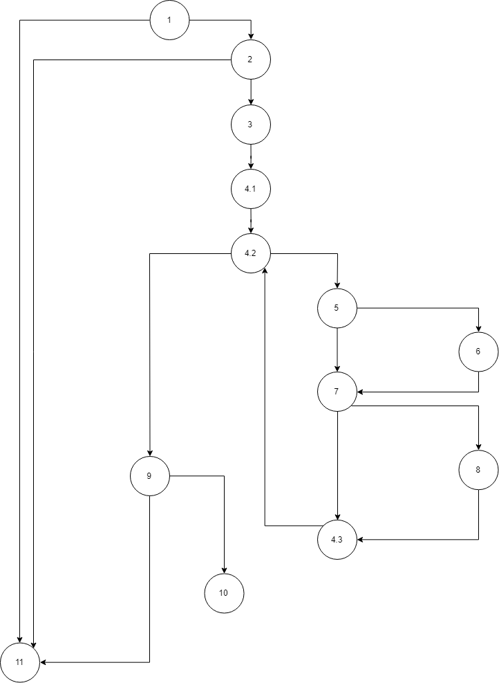

# Втора лабораториска вежба по Софтверско инженерство
## Сергеј Петковски, бр. на индекс 173056
### Група на код:
Ја добив групата на код 1

### Control Flow Graph

### Цикломатска комплексност
Цикломатската комплексност на овој код е 7, истата ја добив преку формулата P+1, каде што P е бројот на предикатни јазли. Во случајoв P=6, па цикломатската комплексност изнесува 7.
### Тест случаи според критериумот Multiple condition

### Тест случаи според критериумот Every branch

### Објаснување на напишаните unit tests
<b>Multiple condition</b>
 

<b>if (user.getUsername()!=null && user.getEmail()!=null && !allUsers.contains(user.getUsername()))</b>
<table>
  <tr>
  <th>Combination</th>
    <th>Test case</th>
    <th>Branch</th>
  </tr>
  <tr>
    <td>TTT</td> <td>user.getUsername()=="sergej" && user.getEmail()=="sergej.petkovski@finki.mk" && !allUsers.contains(user.getUsername())</td> <td>2-3</td>
  </tr>
  <tr>
    <td>FXX</td> <td>user.getUsername()==null</td> <td>2-11</td>
  </tr>
  <tr>
    <td>TFX</td> <td>user.getUsername()=="sergej" && user.getEmail()==null</td> <td>2-11</td>
  </tr>
  <tr>
    <td>TTF</td> <td>user.getUsername()=="sergej" && user.getEmail()=="sergej.petkovski@finki.mk" && !allUsers.contains(user.getUsername())==false</td> <td>2-11</td>
  </tr>
</table>

<b>Every branch</b>
 

